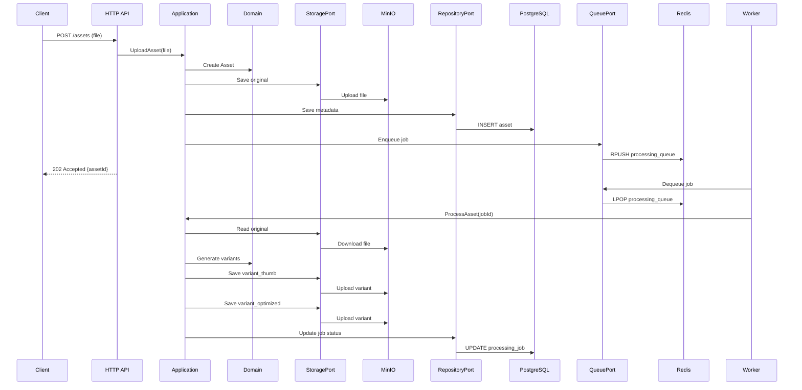
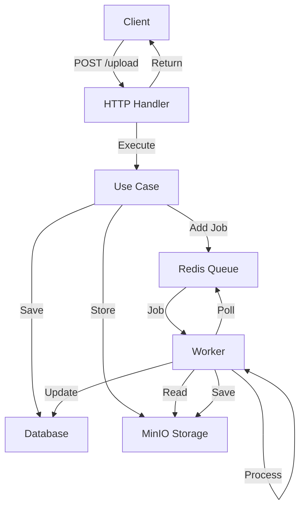

# Request Flow

## Upload Asset Flow

```
1. Client sends POST /api/v1/assets with file
   ↓
2. HTTP Adapter validates request
   ↓
3. Application calls UploadAsset use case
   ↓
4. Domain creates Asset entity
   ↓
5. Application calls StoragePort.Save() → MinIO adapter stores original
   ↓
6. Application calls RepositoryPort.Save() → PostgreSQL stores metadata
   ↓
7. Application calls QueuePort.Enqueue() → Redis queues processing job
   ↓
8. HTTP Adapter returns 202 Accepted with asset ID
   ↓
9. Client receives response
```

## Processing Flow

```
1. Worker polls Redis for jobs (QueuePort)
   ↓
2. Worker receives ProcessingJob
   ↓
3. Application calls ProcessAsset use case
   ↓
4. Application calls StoragePort.Read() → MinIO retrieves original
   ↓
5. Domain/Worker generates variants (resize, optimize)
   ↓
6. Application calls StoragePort.Save() → MinIO stores each variant
   ↓
7. Application calls RepositoryPort.Update() → PostgreSQL updates job status
   ↓
8. Processing complete, status = "completed"
```

## Download Asset Flow

```
1. Client sends GET /api/v1/assets/{id}/variants/{variant_type}
   ↓
2. HTTP Adapter validates request
   ↓
3. Application calls DownloadAsset use case
   ↓
4. Application calls RepositoryPort.Get() → Fetch asset metadata
   ↓
5. Application calls StoragePort.Read() → MinIO retrieves variant
   ↓
6. HTTP Adapter returns file with appropriate headers
   ↓
7. Client receives asset
```

---

# Sequence Diagram



---

# Architecture Diagram



---

## Navigation

Previous: **[01 - Layers](01-layers.md)**

Next: **[03 - Structure](03-structure.md)**

Explore how the project is organized on disk and how each package maps to the architecture.
