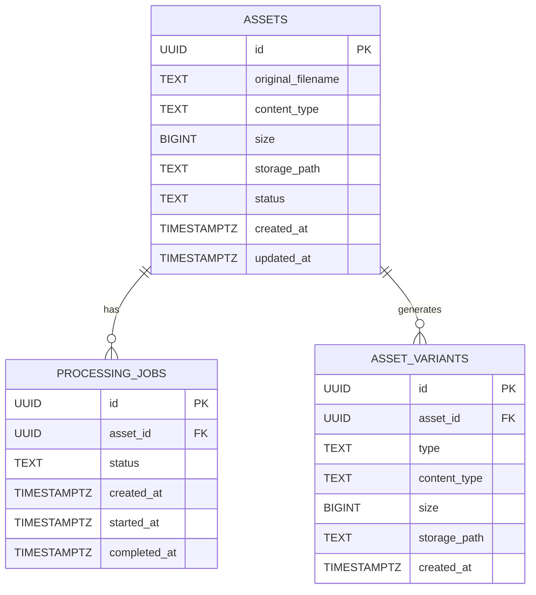

```mermaid
erDiagram
    ASSETS ||--o{ PROCESSING_JOBS : has
    ASSETS ||--o{ ASSET_VARIANTS : generates

    ASSETS {
        UUID id PK
        TEXT original_filename
        TEXT content_type
        BIGINT size
        TEXT storage_path
        TEXT status
        TIMESTAMPTZ created_at
        TIMESTAMPTZ updated_at
    }

    PROCESSING_JOBS {
        UUID id PK
        UUID asset_id FK
        TEXT status
        TIMESTAMPTZ created_at
        TIMESTAMPTZ started_at
        TIMESTAMPTZ completed_at
    }

    ASSET_VARIANTS {
        UUID id PK
        UUID asset_id FK
        TEXT type
        TEXT content_type
        BIGINT size
        TEXT storage_path
        TIMESTAMPTZ created_at
    }
```
