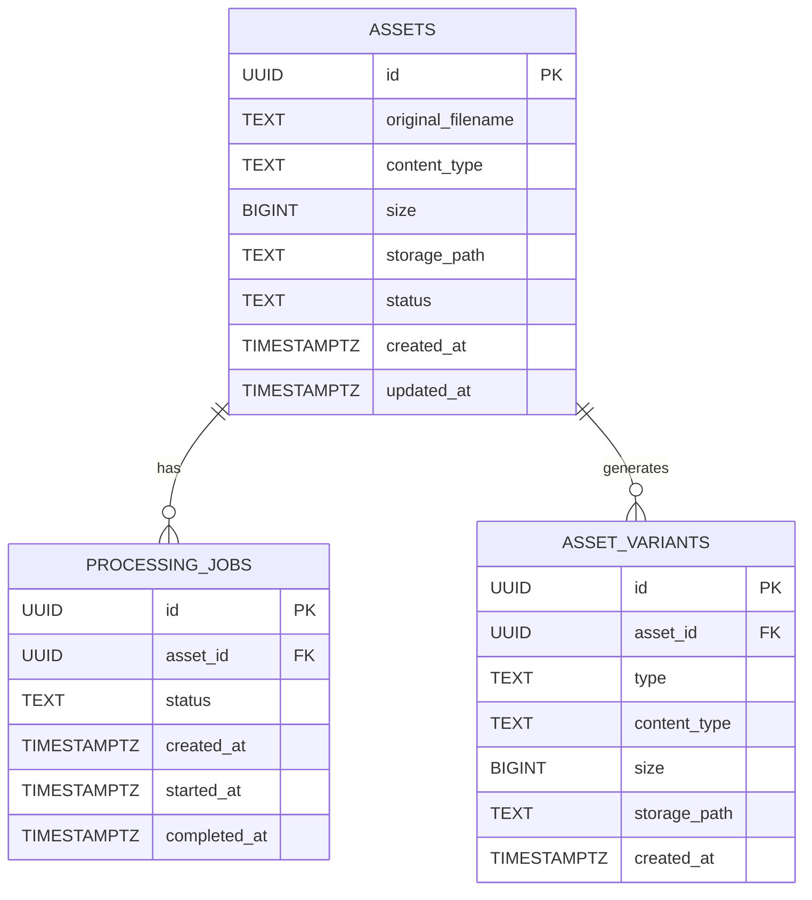

# Database Design

## Entity Relationship Diagram



---

## Table Specifications

### ASSETS

Stores metadata for all uploaded assets.

| Column | Type | Purpose |
|--------|------|---------|
| `id` | UUID | Primary key, unique identifier |
| `original_filename` | TEXT | Original filename provided by user |
| `content_type` | TEXT | MIME type (e.g., `image/jpeg`) |
| `size` | BIGINT | File size in bytes |
| `storage_path` | TEXT | Path in object storage (MinIO) |
| `status` | TEXT | Current status (e.g., `uploaded`, `processing`, `ready`) |
| `created_at` | TIMESTAMPTZ | Timestamp when asset was uploaded |
| `updated_at` | TIMESTAMPTZ | Timestamp of last update |

### PROCESSING_JOBS

Tracks the async processing state of each asset.

| Column | Type | Purpose |
|--------|------|---------|
| `id` | UUID | Primary key, unique identifier |
| `asset_id` | UUID | Foreign key to ASSETS |
| `status` | TEXT | Job status (e.g., `queued`, `processing`, `completed`, `failed`) |
| `created_at` | TIMESTAMPTZ | When the job was created |
| `started_at` | TIMESTAMPTZ | When processing began (nullable) |
| `completed_at` | TIMESTAMPTZ | When processing finished (nullable) |

### ASSET_VARIANTS

Stores metadata for generated variants (thumbnails, optimized versions, etc.).

| Column | Type | Purpose |
|--------|------|---------|
| `id` | UUID | Primary key, unique identifier |
| `asset_id` | UUID | Foreign key to ASSETS |
| `type` | TEXT | Variant type (e.g., `thumbnail`, `optimized`, `preview`) |
| `content_type` | TEXT | MIME type of variant |
| `size` | BIGINT | File size in bytes |
| `storage_path` | TEXT | Path in object storage (MinIO) |
| `created_at` | TIMESTAMPTZ | When variant was generated |

---

## Design Rationale

### Why UUID?

**Advantages:**

- **Distributed-friendly**: UUIDs can be generated client-side without database round-trips
- **Security**: Harder to guess asset IDs compared to sequential integers
- **Scalability**: No central ID generator bottleneck if sharding is needed later
- **URL-safe**: Works directly in REST API URLs

### Why Separate PROCESSING_JOBS Table?

**Advantages:**

- **Separation of concerns**: Processing state is independent from asset metadata
- **Queryability**: Easy to find stalled, failed, or pending jobs
- **Auditability**: Complete history of processing attempts
- **Scalability**: Processing table can be archived/pruned independently

### Why ASSET_VARIANTS Table?

**Advantages:**

- **Metadata tracking**: Stores variant size, type, and storage location
- **Redundancy avoidance**: Prevents storing variant metadata in ASSETS
- **Queryability**: Can list all variants for an asset
- **Auditability**: Creation timestamp for each variant

---

## Migration Naming Convention

Migrations follow the Goose format with descriptive names:

```
migrations/
├── 0001_create_schema.sql
├── 0002_add_asset_indices.sql
├── 0003_add_webhook_table.sql
```

**Naming pattern:** `NNNN_description.sql`

- **NNNN**: 4-digit sequence number (ensures ordering)
- **description**: Snake case, describes the change
- Both UP and DOWN migrations included in each file

---

## Indexing Strategy

Recommended indices for common queries:

```sql
-- Find assets by status
CREATE INDEX idx_assets_status ON assets(status);

-- Find variants by asset
CREATE INDEX idx_asset_variants_asset_id ON asset_variants(asset_id);

-- Find jobs by status
CREATE INDEX idx_processing_jobs_status ON processing_jobs(status);

-- Find jobs by asset
CREATE INDEX idx_processing_jobs_asset_id ON processing_jobs(asset_id);

-- Find jobs by creation date (for archival)
CREATE INDEX idx_processing_jobs_created_at ON processing_jobs(created_at);
```

---

## Current Migration Status

The database is initialized with:

- `0001_create_schema.sql` - Initial three-table schema
- All migrations managed by Goose

Run migrations with:

```bash
make migrate        # Apply pending migrations
goose up            # Manual migration apply
goose down          # Rollback one migration
```

---

## Future Considerations

**v2 Features (Potential Schema Changes):**

- User authentication table
- API keys table for application access
- Webhooks table for event notifications
- Folders table for asset organization
- Audit log table for compliance

Each will follow the same design principles: UUIDs, separate concerns, comprehensive indexing.

---

## Navigation

**Previous:** [04 - Guidelines](04-guidelines.md)

You've reached the end of the architecture documentation.

Return to the **[Architecture Index](README.md)** for a complete overview.
