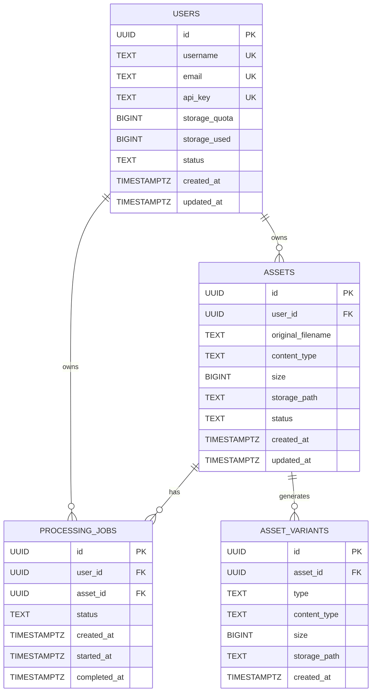

# Database Design

## Entity Relationship Diagram


```mermaid
erDiagram
    USERS ||--o{ ASSETS : owns
    USERS ||--o{ PROCESSING_JOBS : owns
    ASSETS ||--o{ PROCESSING_JOBS : has
    ASSETS ||--o{ ASSET_VARIANTS : generates

    USERS {
        UUID id PK
        TEXT username UK
        TEXT email UK
        TEXT api_key UK
        BIGINT storage_quota
        BIGINT storage_used
        TEXT status
        TIMESTAMPTZ created_at
        TIMESTAMPTZ updated_at
    }

    ASSETS {
        UUID id PK
        UUID user_id FK
        TEXT original_filename
        TEXT content_type
        BIGINT size
        TEXT storage_path
        TEXT status
        TIMESTAMPTZ created_at
        TIMESTAMPTZ updated_at
    }

    PROCESSING_JOBS {
        UUID id PK
        UUID user_id FK
        UUID asset_id FK
        TEXT status
        TIMESTAMPTZ created_at
        TIMESTAMPTZ started_at
        TIMESTAMPTZ completed_at
    }

    ASSET_VARIANTS {
        UUID id PK
        UUID asset_id FK
        TEXT type
        TEXT content_type
        BIGINT size
        TEXT storage_path
        TIMESTAMPTZ created_at
    }
```

---

## Table Specifications

### USERS

Stores user account information and authentication credentials.

| Column | Type | Purpose |
|--------|------|---------|
| `id` | UUID | Primary key, unique identifier |
| `username` | TEXT | Unique username for login |
| `email` | TEXT | Unique email for contact |
| `api_key` | TEXT | Hashed API key for Bearer token auth |
| `storage_quota` | BIGINT | Maximum storage in bytes (default: 10GB) |
| `storage_used` | BIGINT | Current storage usage in bytes |
| `status` | TEXT | Account status (active, suspended, deleted) |
| `created_at` | TIMESTAMPTZ | Account creation timestamp |
| `updated_at` | TIMESTAMPTZ | Last update timestamp |

### ASSETS

Stores metadata for all uploaded assets. Now includes user_id for isolation.

| Column | Type | Purpose |
|--------|------|---------|
| `id` | UUID | Primary key, unique identifier |
| `user_id` | UUID | Foreign key to USERS (enforces ownership) |
| `original_filename` | TEXT | Original filename provided by user |
| `content_type` | TEXT | MIME type (e.g., image/jpeg) |
| `size` | BIGINT | File size in bytes |
| `storage_path` | TEXT | Path in object storage (MinIO) |
| `status` | TEXT | Current status (e.g., uploaded, processing, ready) |
| `created_at` | TIMESTAMPTZ | Timestamp when asset was uploaded |
| `updated_at` | TIMESTAMPTZ | Timestamp of last update |

### PROCESSING_JOBS

Tracks the async processing state of each asset. Now includes user_id for audit trails.

| Column | Type | Purpose |
|--------|------|---------|
| `id` | UUID | Primary key, unique identifier |
| `user_id` | UUID | Foreign key to USERS (denormalized for fast user-scoped queries) |
| `asset_id` | UUID | Foreign key to ASSETS |
| `status` | TEXT | Job status (e.g., queued, processing, completed, failed) |
| `created_at` | TIMESTAMPTZ | When the job was created |
| `started_at` | TIMESTAMPTZ | When processing began (nullable) |
| `completed_at` | TIMESTAMPTZ | When processing finished (nullable) |

### ASSET_VARIANTS

Stores metadata for generated variants (thumbnails, optimized versions, etc.).

| Column | Type | Purpose |
|--------|------|---------|
| `id` | UUID | Primary key, unique identifier |
| `asset_id` | UUID | Foreign key to ASSETS |
| `type` | TEXT | Variant type (e.g., thumbnail, optimized, preview) |
| `content_type` | TEXT | MIME type of variant |
| `size` | BIGINT | File size in bytes |
| `storage_path` | TEXT | Path in object storage (MinIO) |
| `created_at` | TIMESTAMPTZ | When variant was generated |

---

## Design Rationale

### Why UUID?

Advantages:
- Distributed-friendly: UUIDs can be generated client-side without database round-trips
- Security: Harder to guess asset IDs compared to sequential integers
- Scalability: No central ID generator bottleneck if sharding is needed later
- URL-safe: Works directly in REST API URLs

### Why Separate USERS Table?

Advantages:
- Authentication: Centralized credential management
- Quota Management: Track per-user storage limits and usage
- Audit Trail: Complete record of account status changes
- Future Extensions: Easy to add roles, organizations, subscriptions

### Why user_id in ASSETS?

Advantages:
- Data Isolation: Database-enforced foreign key prevents cross-user data access
- Query Performance: Composite index (user_id, status) speeds up user-scoped queries
- Soft Deletes: Can mark accounts as deleted without orphaning assets

### Why user_id in PROCESSING_JOBS?

Advantages:
- Denormalization: Avoid multi-join queries for user-scoped job queries
- Rate Limiting: Easy to count jobs per user for fairness
- Audit Logs: Track which user's jobs are failing or stalled

### Why Separate PROCESSING_JOBS Table?

Advantages:
- Separation of concerns: Processing state is independent from asset metadata
- Queryability: Easy to find stalled, failed, or pending jobs
- Auditability: Complete history of processing attempts
- Scalability: Processing table can be archived/pruned independently

### Why ASSET_VARIANTS Table?

Advantages:
- Metadata tracking: Stores variant size, type, and storage location
- Redundancy avoidance: Prevents storing variant metadata in ASSETS
- Queryability: Can list all variants for an asset
- Auditability: Creation timestamp for each variant

---

## Indexing Strategy

Recommended indices for common queries:

```sql
-- User isolation: Find assets by user and status
CREATE INDEX idx_assets_user_id ON assets(user_id);
CREATE INDEX idx_assets_user_status ON assets(user_id, status);

-- User isolation: Find variants for user's assets
CREATE INDEX idx_asset_variants_asset_id ON asset_variants(asset_id);

-- User isolation: Find jobs by user
CREATE INDEX idx_processing_jobs_user_id ON processing_jobs(user_id);
CREATE INDEX idx_processing_jobs_user_status ON processing_jobs(user_id, status);
CREATE INDEX idx_processing_jobs_asset_id ON processing_jobs(asset_id);

-- Job queries: Find by creation date (for archival, fairness)
CREATE INDEX idx_processing_jobs_created_at ON processing_jobs(created_at);

-- Authentication: API key lookup (hashed)
CREATE UNIQUE INDEX idx_users_api_key ON users(api_key);
```

---

## Migration Naming Convention

Migrations follow the Goose format with descriptive names:

```
migrations/
0001_create_schema.sql
0002_add_multi_user_support.sql
```

Naming pattern: NNNN_description.sql

- NNNN: 4-digit sequence number (ensures ordering)
- description: Snake case, describes the change
- Both UP and DOWN migrations included in each file

---

## Multi-Tenancy Data Access Pattern

All repository queries must include user_id to enforce isolation:

```go
// INCORRECT: Missing user_id filter
AssetRepo.GetByID(ctx, assetID)

// CORRECT: User_id ensures isolation
AssetRepo.GetByID(ctx, assetID, userID)
```

See ADR 004: Multi-Tenancy Strategy for detailed isolation design.

---

## Migration Status

The database is initialized with:

- 0001_create_schema.sql - Initial three-table schema (assets, processing_jobs, asset_variants)

### Planned Migrations (Multi-User)

- 0002_add_multi_user_support.sql - Add users table and user_id foreign keys (Planned)

All migrations managed by Goose

Run migrations with:

```bash
make migrate        # Apply pending migrations
goose up            # Manual migration apply
goose down          # Rollback one migration
make goose-status   # Check migration status
```

---

## Future Considerations

Potential v2 schema changes:

- Organizations table (group users, share assets)
- API keys table (multiple keys per user, fine-grained permissions)
- Webhooks table (event notifications to user URLs)
- Folders table (asset organization and namespacing)
- Audit log table (compliance and forensics)
- Usage metrics table (billing data)

Each will follow the same design principles: UUIDs, separate concerns, comprehensive indexing, and explicit user_id enforcement.

---

## Navigation

Previous: [04 - Guidelines](04-guidelines.md)

Related: [ADR 004 - Multi-Tenancy Strategy](../decisions/004-multi-tenancy-strategy.md)

Return to the [Architecture Index](README.md) for a complete overview.
